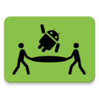

SafetyNet Helper
=================

SafetyNet Helper wraps the Google Play Services SafetyNet.API and verifies Safety Net API response with the [Android Device Verification API](https://developer.android.com/google/play/safetynet/start.html#verify-compat-check). The SafetyNet.API analyses the device your app is running on to test it's software/hardware configuration matches that of a device that has passed the Android Compatibility Test Suite (CTS). 

*Rooted* devices seem to cause `ctsProfileMatch=false`.

**Recommend reading the developers guide to getting started with [SafetyNet](https://developer.android.com/google/play/safetynet/start.html)**





Extract from Android [SafetyNet API doc](https://developer.android.com/google/play/safetynet/index.html)

*Check if your app is running on a device that matches a device model that has passed Android compatibility testing. This analysis can help you determine if your app will work as expected on the device where it is installed. The service evaluates both software and hardware characteristics of the device, and may use hardware roots of trust, when available.*


##Features

* Calls Google play services Safety Net test
* Local varification of request
* Verifies Safety Net API resoinse with the Android Device Verification API (over SSL pinned connection) 
  	

## Requires

* Google Play services 7+ 
* Requires Internet permission
* API key for the Android Device Verification API (in the sample project this is set via a BuildConfig field to keep my api out of github)


## How to use

You'll need to get a API key from the Google developer console to allow you to verifiy with the Android Device Verification API

```java
    final SafetyNetHelper safetyNetHelper = new SafetyNetHelper(API_KEY);
    
    safetyNetHelper.requestTest(context, new SafetyNetHelper.SafetyNetWrapperCallback() {
             @Override
             public void error(int errorCode, String msg) {
             	 //handle and retry depending on errorCode
                 Log.e(TAG, msg);
              }

             @Override
             public void success(boolean ctsProfileMatch) {
             	if(ctsProfileMatch){
             		//handle pass 
             	}else{
             		//handle fail, maybe warn user device is unsupported?
             	}	
             }
         });
```

## Sample App

The sample app illustrates the helper library in practice. Test your own devices today. 

* TODO screen shots


##Licence 

	Copyright (c) 2015 Scott Alexander-Bown
    
    Licensed under the Apache License, Version 2.0 (the "License");
    you may not use this file except in compliance with the License.
    You may obtain a copy of the License at